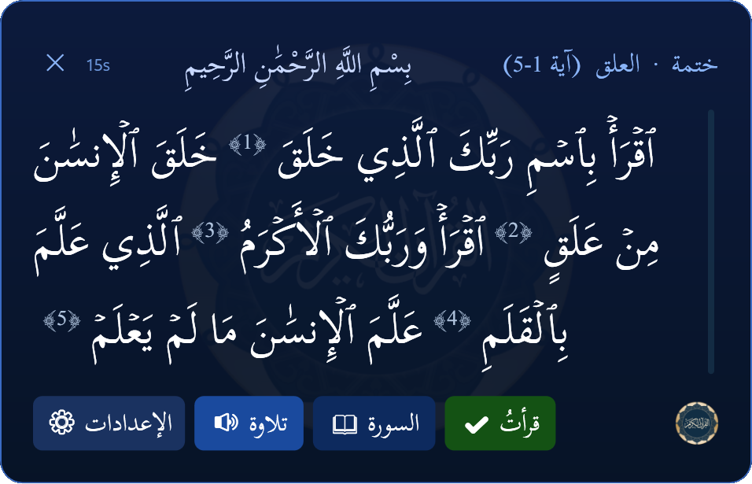
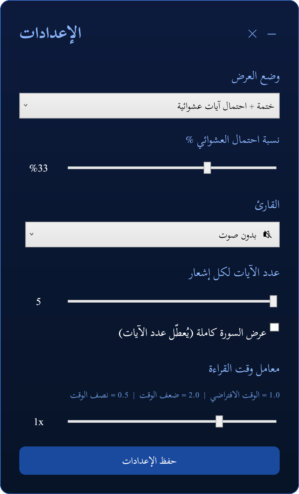

  

 

<table align="center">
<tr>
<td align="center" width="40%">

</td>
<td align="left" width="60%">

<h1> ☪︎ Hourly Quran ☪︎ </h1>
🌙 A calm companion for your day — bringing the Words of Allah ﷻ to you every hour  

## ✨ Overview

**Hourly Quran** is a Windows desktop utility that automatically delivers Qur’anic verses every hour — helping you stay consistent in remembrance, reflection, and recitation.

It blends **automation, simplicity, and spirituality** into a seamless experience.

</td>
</tr>
</table>

 

---

---

## 🌟 Features

🕐 **Hourly Verse Delivery**  
Receive verses automatically every hour.

🎧 **Audio Recitation**  
Listen using multiple reciters.

🎯 **Smart Modes**
- 📘 Khitma Mode: Start recieving verses hourly of the entire quran from start to finish. Practically doing a Khitma!
- 🎲 Random Mode: Recieve random sets of sequential verses.
- 🔄 Alternating Mode: Alternate between Khitma and Random modes back to back.
- ⚖️ Priority Mode: Khitma mode but with chance of getting random mode (the chance is adjustable in settings)  

📖 **Full Surah Access**  
Expand from selected verses to the entire Surah.

⚙️ **Full Customization**
- Adjust popup duration ⏳  
- Control number of verses 🔢  
- Display full Surahs 📘  
- Change the reciter 📘  

---

## ⚙️ How It Works

- 🧠 **PowerShell** handles logic and automation  
- 🖥️ **Windows Task Scheduler** ensures **hourly startup automatically**  
- 🎨 **WPF** provides a modern interface  
- 🎵 **Windows MCI** handles audio playback  

---

## 🖼️ Screenshots & Guide

<table align="center">
<tr>
<td align="center" width="50%">

### 🕐 Main Reminder Popup  

 

### 💡 Usage Tips

- ⚙️ **Settings Button (الإعدادات)**  
  Opens the settings popup where you can customize various things:
=
- 🔊 **Tilawa Button (تلاوة)**  
  Recites the verses using your selected reciter  

- 📖 **Surah Button (السورة)**  
  Shows the full Surah from which the verses are taken  

- ✔️ **Read Button (قرأت)** *(Khitma Mode only)*  
  Marks current verses as read and continues with the next verses in the following hour  

- ⏱️ **Popup Duration**  
  Automatically adjusts based on verse length  
  You can close it anytime using the ❌ button next to it

</td>
<td align="center" width="50%">

### ⚙️ Settings Interface  

 

### 💡 Settings Tips

- 🎯 **Mode (وضع العرض)**  
  Change between *Khitma*, *Random*, *Alternating*, and *Priority* modes 
  (A slider under it will appear when you select Priority mode to adjust the chance of Random mode appearing)

- 🎧 **Reciter (القارئ)**  
  Select your favorite reciter *(download required — use the download button to get audio files)*  

- 🔢 **Number of Verses each time (عدد الآيات لكل إشهار)**  
  Choose how many verses you will receive every hour 
  (A checkbox under it can be used to view entire surah instead) 

- ⏱️ **Timer Length (معامل وقت القراءة)**  
  Adjust based on your reading speed  

</td>
</tr>
</table>

---

## 📥 Installation & Tutorial

**Step 1:** Download from **Releases** or clone the repository  

**Step 2:** Extract into any folder you want except system folders like `"Program Files"`  

**Step 3:** Run `Install_HourlyQuran.bat`  

**Step 4:** Input `1` then press `Enter` to install the scheduled task  

**Step 5:** Let the Qur’an accompany your hours 🤲🌙  

> “And remind, for indeed, the reminder benefits the believers.” ☪️  

⚠️ Do NOT move the folder after installation. If it was moved, simply repeat step 4.  

---

## 📦 Credits

- 👨‍💻 Author → MDJ-Github (Me ^_^)
- 📖 Qur’an Text → Risan's Qur’an JSON
- 🎧 Recitations → Every Ayah 
- ✏️ Fonts → Google Fonts
- 💡 Inspiration → Aunt Souma
- ❤️ Support → Family

---

## 🕌 Final Note

May this tool bring barakah into your daily life and make the Qur’an your constant companion.

> 🤲 “O Allah, make the Qur’an the light of our hearts.”